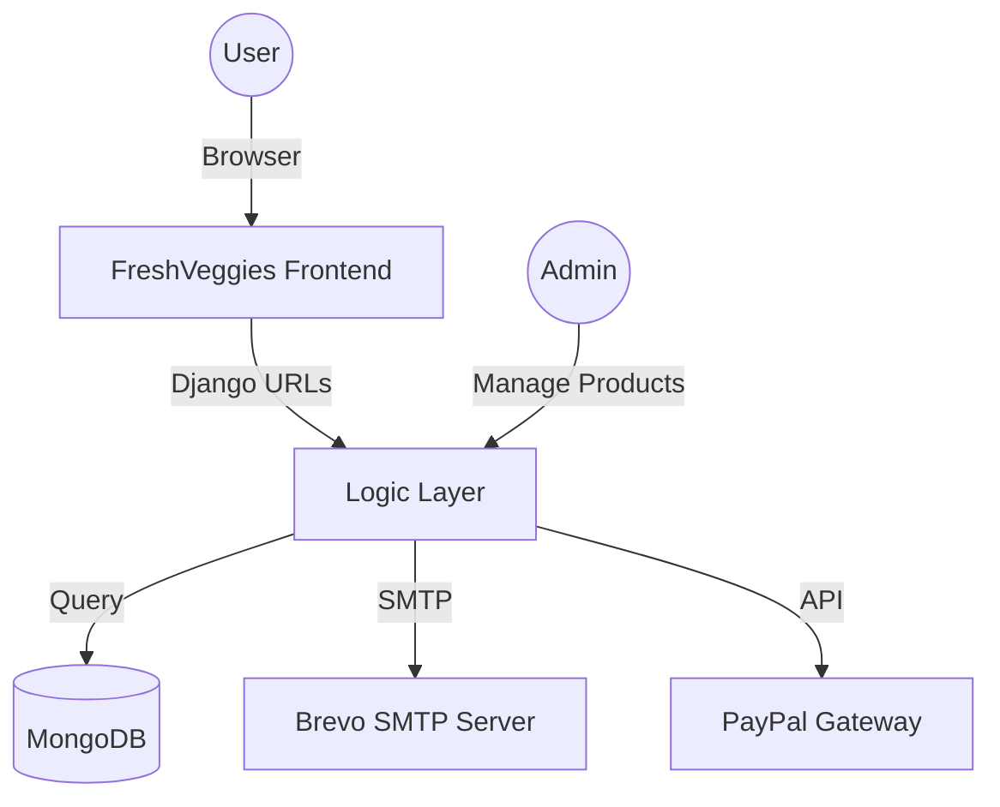

# 🌿 FreshVeggies Platform

> **Pure. Organic. Fresh. — From local farms to your doorstep.**

FreshVeggies is a premium, high-performance E-commerce platform built with **Django** and **MongoDB**. It offers a seamless farm-to-door grocery experience, focusing on organic produce, secure transactions, and a modern, high-conversion UI.

---

## ✨ Key Features

- 🛒 **Advanced Cart System**: Real-time Ajax-powered cart updates for a smooth user experience.
- 🔐 **Secure Authentication**: Robust user registration, login, and password management.
- 📦 **Order Management**: Track your orders from farm to doorstep.
- 💳 **Integrated Payments**: Support for PayPal (Sandbox) and Cash on Delivery.
- 📧 **Professional Communications**: Clean, high-impact HTML email templates for order notifications and contact forms.
- 🛡️ **Security First**: Environment variable-based secret management (using `.env`) and CSRF-secure cart operations.
- 🍃 **Premium UI/UX**: SaaS-like aesthetic with compact navigation and modern typography.

---

## 🏗️ Architecture



---

## 🛠️ Technology Stack

| Layer | Technology |
| :--- | :--- |
| **Backend** | Django 2.2 / Python 3.11 |
| **Database** | MongoDB (integrated via Djongo) |
| **Frontend** | HTML5, CSS3, JavaScript (Ajax/jQuery) |
| **Styling** | Custom CSS + Bootstrap 5 |
| **Email** | Brevo SMTP Relay |
| **Payment** | PayPal SDK |

---

## 🚀 Getting Started

### 1. Prerequisites
- Python 3.11+
- MongoDB (Running locally on `127.0.0.1:27017`)

### 2. Installation
```bash
# Clone the repository (if you haven't already)
git clone https://github.com/sanathkmr14/FreshVeggies-Platform.git
cd FreshVeggies-Platform/shop

# Install dependencies
pip install -r requirements.txt
```

### 3. Environment Setup
Create a `.env` file in the project root:
```env
EMAIL_HOST_PASSWORD=your_brevo_password
PAYPAL_CLIENT_ID=your_paypal_id
PAYPAL_CLIENT_SECRET=your_paypal_secret
```

### 4. Database Setup
```bash
python manage.py makemigrations
python manage.py migrate
```

### 5. Run the Server
```bash
python manage.py runserver 127.0.0.1:8000
```

---

## 👤 Admin Access
To manage products and view contact form submissions, visit `/admin/`. Ensure you have created a superuser locally:
```bash
python manage.py createsuperuser
```

---

## 👨‍💻 Developed By
**Sanath Kumar** - [GitHub](https://github.com/sanathkmr14)

---

> [!NOTE]
> This project uses MongoDB. Ensure your local MongoDB instance is active before running the server.
